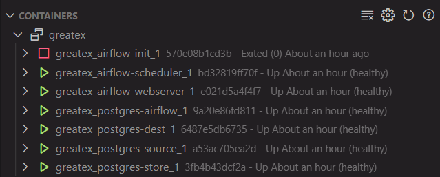
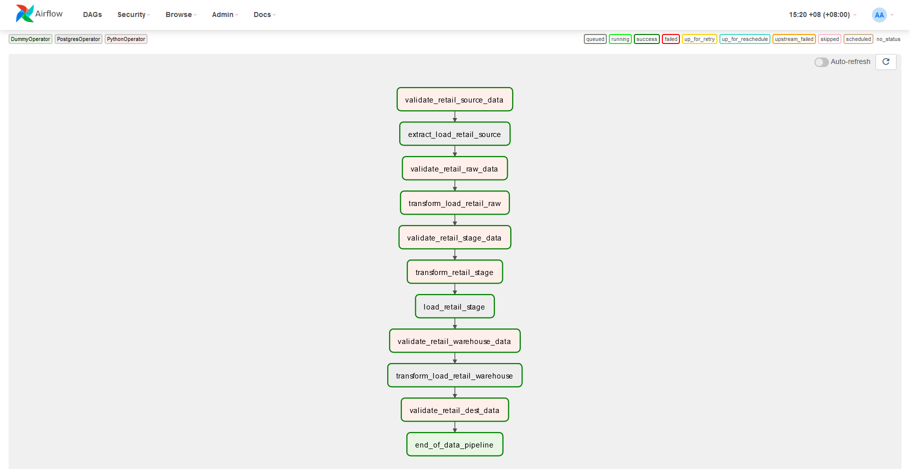

# Airflow Data Pipeline Validation with Great Expectations

## Introduction

This project looks at how Great Expectations can be used to ensure data quality within an Airflow
pipeline. All the databases and Airflow components are designed to run within Docker containers, so that
it's easy to set it up with a `docker-compose` file. The setup for this architecture is supposed to run on
Windows OS, but a very similar setup can be done to run on Linux as well.

[**Official Documentation**](https://docs.greatexpectations.io/en/latest/) - the new official documentation

[**Legacy Documentation**](https://legacy.docs.greatexpectations.io/en/latest/) - old legacy docs

**Repo directory structure:**

    .
    ├── dags
    │   ├── scripts
    │   │   ├── python
    │   │   │   ├── filesystem_raw_conn.py
    │   │   │   ├── filesystem_stage_conn.py
    │   │   │   ├── postgres_dest_conn.py
    │   │   │   ├── postgres_source_conn.py
    │   │   │   └── postgres_warehouse_conn.py    
    │   │   └── sql
    │   │       ├── extract_load_retail_source.sql
    │   │       ├── load_retail_stage.sql
    │   │       └── transform_load_retail_warehouse.sql
    │   ├── retail_data_pipeline.py
    │   └── transformations.py
    ├── database-setup
    │   ├── destinationdb.sql
    │   └── sourcedb.sql
    ├── dest-data
    │   └── dummy.txt
    ├── filesystem
    │   ├── raw
    │   │   └── dummy.txt
    │   └── stage
    │       ├── temp
    │       ├   └── dummy.txt
    │       └── dummy.txt
    ├── great_expectations
    │   ├── checkpoints
    │   │   ├── retail_dest_checkpoint.yml
    │   │   ├── retail_load_checkpoint.yml
    │   │   ├── retail_source_checkpoint.yml
    │   │   ├── retail_transform_checkpoint.yml
    │   │   └── retail_warehouse_checkpoint.yml
    │   ├── expectations
    │   │   ├── .ge_store_backend_id
    │   │   ├── retail_dest_suite.json
    │   │   └── retail_source_suite.json
    │   ├── uncommitted
    │   │   └── config_variables.yml
    │   ├── .gitignore
    │   └── great_expectations.yml
    ├── source-data
    │   ├── retail_profiling.csv
    │   └── retail_validating.csv
    ├── .dockerignore
    ├── .gitattributes
    ├── .gitignore
    ├── Dockerfile
    ├── README.md
    ├── airflow_conn.ps1
    ├── docker-compose.yml
    └── requirements.txt

## Setup

Clone this repository,  

    git clone https://github.com/ismaildawoodjee/GreatEx; cd GreatEx

Prepare a Python virtual environment,

    python -m venv .venv; .venv\Scripts\Activate.ps1

And initialize the Airflow containers.

    docker-compose up airflow-init

Start the containers in the background with:

    docker-compose up -d

After this, we want to add our Postgres database connections to Airflow, for which I have provided
a convenience script with `airflow_conn.ps1`. Run this Powershell script with:

    .\airflow_conn.ps1

If you are using VS Code, you can check the health of the containers with the Docker extension:

Otherwise, type `docker ps -a` into the terminal to check their health status.
Once the Airflow Worker and Webserver are in a healthy state, you can go to `localhost:8080` in
the webbrowser to log into the Airflow UI and observe the data pipeline.

## About the `docker-compose` File

The original `docker-compose` file for setting up Airflow containers was obtained from
[Apache Airflow instructions](https://airflow.apache.org/docs/apache-airflow/stable/start/docker.html)
for running Airflow in Docker. I modified it in several different ways:

- Set `AIRFLOW__CORE__LOAD_EXAMPLES` to `false` to declutter the Airflow UI.
- An additional environment variable `AIRFLOW_CONN_POSTGRES_DEFAULT` for the Airflow meta database, which I renamed to `postgres-airflow`.
- I wrote a Dockerfile to extend the image (according to [the official docs](https://airflow.apache.org/docs/docker-stack/build.html#extending-the-image))
  so that the Great Expectations library and other packages will be installed inside the containers.
- Added two additional PostgresDB containers `postgres-source` and `postgres-dest` to represent the retail data source and the destination data warehouse.
- For Airflow to properly orchestrate these containers, their volumes and port mappings were also specified, e.g. "5433:5432" for the source database so that it
  won't conflict with Airflow's meta database mapping "5432:5432".
- The service names for the containers are also their hostnames, so we should keep that in mind
  (else Docker will keep searching for the wrong services and won't find them). Below, I changed the service name from the default `postgres` to `postgres-airflow`,
  so the hostname in the connection strings must also be changed:

    

  This also applies to username, password and database names.
- The Docker images for Airflow and Postgres can be any supported version, but I specified them to use the `latest` tag, and used Python version 3.8.

## Retail Pipeline DAG

Currently, the Airflow DAG looks like the following:

- `validate_retail_source_data`: This task uses the BashOperator to run a GreatEx Checkpoint for validating data in the
  `postgres-source` database. A Checkpoint is a pair between a Datasource and an Expectation Suite, so to create a Checkpoint,
  both the Datasource and the Expectation Suite must be present (see the section on [Configuring Great Expectations](#configuring-great-expectations)).

- `extract_load_retail_source`: This task extracts data from the `postgres-source` database and loads it into the `raw`
  directory of the `filesystem`. The `filesystem` could represent a cloud data lake, or an on-premise file storage system.
  The SQL script that is run in this task can be a customized query to pull any kind of data from the source.

- `validate_retail_raw_data`: This task runs another GreatEx Checkpoint to validate data that has just landed in the `raw` folder.
  It uses the same Expectation Suite, but uses the data in the `filesystem/raw` directory instead of the `postgres-source` database.

- `transform_load_retail_raw`: After the source data has landed into the `raw` folder, transformations can now take place. Here,
  I just specified a simple transformation where if a country name is `"Unspecified"`, I change it to `None`. Again, any kind of
  customized transformation can be specified. It could be a Python script running on local host, a serverless Lambda function, or
  a Spark cluster. This transformed data is then loaded into the `filesystem/stage` directory in the form of a Parquet file.

- `validate_retail_stage_data`: After the Parquet file has landed into the `stage` folder, another Checkpoint validation takes place.
  A different Expectation Suite can be created and paired up with the staged Datasource
  (I used the same Expectation Suite since there weren't any significant transformations).

- `end_of_data_pipeline`: A DummyOperator to mark the end of the DAG.

## Configuring Great Expectations
